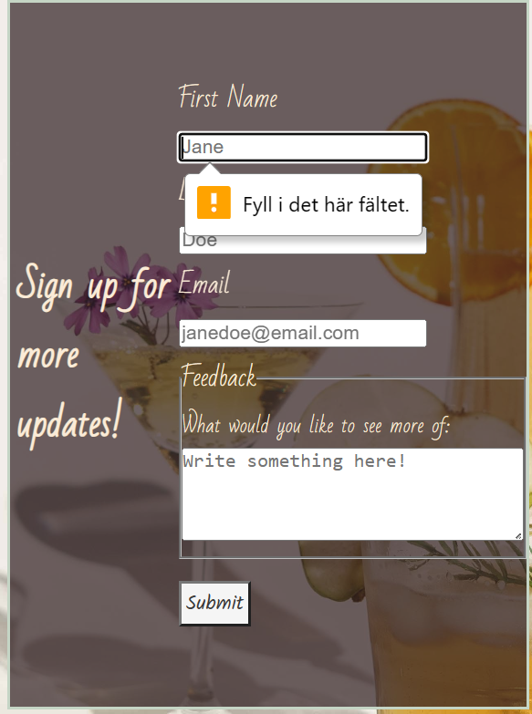

# Elins Home-bar

The purpose of this website is to give people a way of making bar drinks at home. For those who are having a party, maybe want to show off a little, or those who just want to expreiment and see what they like. This will be a great way for people to have fun at home while also not spending as much money as they would out in a physical bar or pub. This site will target those of legal drinking age who are trying to get a bit more information on the drink making scene.

# User Stories

As a visiting user I would like to understand what the page is about from the landing page. I will then use the navigation to go to the drinks page. I would like to make one of the drinks so I will hover with the mouse over one of the six flip-cards. The flip-card will show the backside as long as the mouse hovers over it, thus I can read the recepie for as long as needed.

I would like to get in contact with the owner for some ideas so I will go to the sign up page. I will fill in the whole form as required and make a comment in the feedback field. After submitting this will take me to a new page saying "thank you for viiting my page!" so I know my information has been sent.

## Features

* Navigation Bar

There will be a navigation bar on all the three pages, home, drinks and sign up. The navigation bar will look exactly the same on all these pages for easy navigation. This way the user won't have to revert back using the going back button all the time and can jump to every page no matter which page they are on currently.

* The Landing Page

Information about the website and what the user can expect will be part of the landing page, as well as some pictures.

* Flip-Cards
  
To show the recepies to the user there will be flip-cards on the drinks page. This is to allow the user to first see a picture of the drink and as they hover over the card they will see the recipe. As the saying goes `we feast with our eyes´, so by showing a picture of the drinks first it will catch the users attention and also curiosity to find out how it is made.

* Sign up

For the sign up page the user will be able to subscribe to the page so that they can keep up with new recepies that will be added as time goes on. The user will also be able to send in feedback on this page so they can engage in the content.

* Dump page

Once the form has been submitted, the user will be taken to a new page to confirm that the users information has been sent

* Footer

The footer will also be shown on all three pages and look identical on all of them, this for easy access to social media which will be linked.

## Future features

In the future I would like to add an extra page which will include content of other types of drinks, such as wine and beer. These will have the same outlook as the drinks by being shown on flip-cards, however on the backside there will be a flavor profile instead of a recepie.

I would also like for there to be a search bar at the top of the drinks page so that people won't have to scroll to find what they're looking for.

## Typography and color scheme

For the h1 heading I will use the font Kalam imported from google, I want it to give a homie but also a little fancy feel. This font will also be used in the rest of the heading section, such as the navigation. And for the rest of the page I will use Bad Script.

As for colors, I want to give a soft impression, something that gives off a cute and welcoming feel and for that effect I use pastell in the header and a off  white as the background. For some contrast I have a dark brown used as a background of the paragraphs and flip-cards.

## Technology

Repository was made on github and the website was deployed through github pages.

The code has been written and edited on codeanywhere.

HTML was used to build the structure of the page.

CSS was used to style the page.

Font styles were imported from Google fonts.

Social media icons and navigation bar icon were imported from font awesome.

Favicon created and imported from favicon generator.

## Testing

### Code validation

No errors were found when using the w3c validator and (Jigsaw) validator.

Lighthouse show 100 in accessability.

### Fixed bugs

Quite some issues with the flip-cards, in particular the placement of them as well as having the text fit within the cards.

For the text I only resolved it by shortening the text but I would assume that I also could've made the gap between each line of text smaller. I didn't want the cards to look to muddy though so I just cut down the text. I fixed the placement issue by seperating the cards into two groups with three in each and put display: inline-block; to have them show up in two rows.

### Browsers

  The website has been tested and works on microsoft edge, samsung internet as well as safari on Iphone. By using devtools The website has been made to be responsive and all the features are modified to fit all screens. The flip-cards that flip when you hover with the mouse works just as well when you press on it if you're using a phone or tablet.

## Deployment

### Code anywhere

#### Landing page

User will start on landing page.

 

User will click on drinks in navigation and land on the drinks page.

#### Drinks page

User will hover over the flip-cards to see the recepie on the backside.

#### Sign up page

User will click on sign up in the navigation and go to the sign up page.

User will click submit and see required first name.

User will fill in first name, click submit and see required last name.

User will fill in last name, click submit and see required email.

User will fill in email.

#### Dump page

User will click submit and go to dump page.

### Github

The website was deployed to GitHub pages using the following steps:

Selecting the settings in your chosen repository

Scroll down and select main as your source

This will give you a deployed link

Here is the link for this project: [Elins home-bar](https://elingrahn.github.io/Elins-Bar/)

## Credit

### Content

Borrowed from the Love Running project:

* General styling on the body
* Header
* Nav bar and dropdown toggle
* Styling of the main to put footer down
* Background of the text on the landing page as well as on the sign up page
* Footer, social media styling

Borrowed from Code Institute learning videos:

* Styling of the submit button

Borrowed from w3schools:

* [Flip-cards](https://www.w3schools.com/howto/tryit.asp?filename=tryhow_css_flip_card)

Borrowed from freecodecamp.org on youtube:

* [Forms](https://www.youtube.com/watch?v=kUMe1FH4CHE&t=1316s) for sign up page  

Borrowed Favicon from:

* (<https://favicon.io/favicon-generator/>)

Recepies for the drinks:

* [Drinkoteket](https://drinkoteket.se/)

### Media

* [Font awesome](https://fontawesome.com/search) social media icons and nav for phone screens
* Bramble, Caipirhina, ibiza43, strawberry mojito, signup-background and the two images on the landing page are all from [Pexels](https://www.pexels.com)
* Irish coffee and Kaffe Karlsson are from [Unsplash](https://unsplash.com/)
